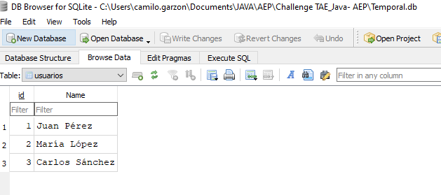
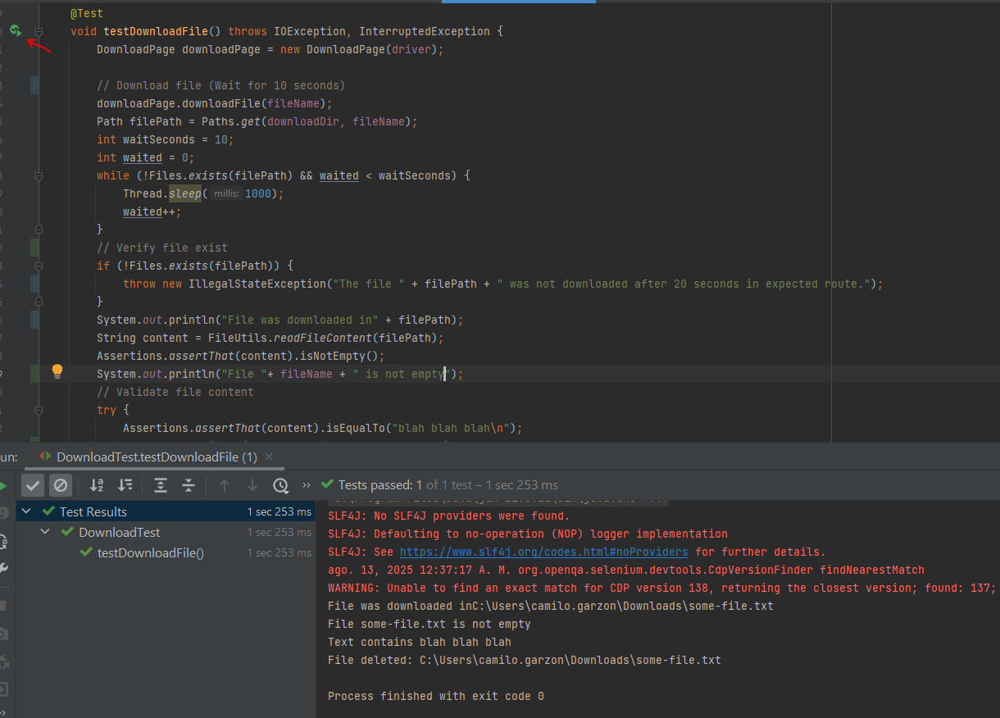

# Challenge-TAE--AEP


## Estructura del proyecto

En esta seccion esta la estructura basica del proyecto, y entre parentesis se encuentra a que ejercicio pertenece el archivo/carpeta

```text
C:.
│   .gitignore
│   estructura.txt
│   img.png
│   pom.xml
│   README.md
│   Temporal.db  (Ejercicio 2)
│
├───.idea
│       archivos por defecto del idea
│
├───src
│   ├───main
│   │   ├───java
│   │   │   ├───testExampleWeb (Ejercicio 3)
│   │   │   │   ├───pages
│   │   │   │   │       DownloadPage.java
│   │   │   │   │
│   │   │   │   └───utils
│   │   │   │           FileUtils.java
│   │   │   │
│   │   │   ├───testExampleAPI (Ejercicio 1)
│   │   │   │   │   ServiceEndPoint.java
│   │   │   │   │
│   │   │   │   └───model
│   │   │   │           Ability.java
│   │   │   │           Pokemon.java
│   │   │   │
│   │   │   └───testExampleDB (Ejercicio 2)
│   │   │           DatabaseConnection.java
│   │   │           DatabaseUtils.java
│   │   │           Main.java
│   │   │
│   │   └───resources
│   └───test
│       └───java
│           ├───testExampleAPI (Ejercicio 1)
│           │       ApiTest.java
│           │
│           ├───testExampleDB (Ejercicio 2)
│           │       DatabaseTest.java
│           │
│           └───testExampleWeb (Ejercicio 3)
│                   DownloadTest.java
│
└───Otras carpetas

```
## Ejercicio 1 -

## Ejercicio 2 - Base de Datos: SQLite y Pruebas Automatizadas

Este proyecto valida cómo conectar, consultar y modificar una base de datos SQLite, así como la automatización de pruebas que demuestren la interaccion con la data.
## Requisitos

- Java 11 o superior
- Maven 3.x
- Google Chrome instalado
- Base de datos con informacion dentro (Para validar coneccion e interaccion con la misma)



## Descripción

..................

## Ejercicio 3 - Automatización Web: Descarga de Archivos

Este proyecto automatiza la descarga y verificación de archivos desde la página [The Internet - Download](https://the-internet.herokuapp.com/download) utilizando Java, Selenium WebDriver, AssertJ y JUnit.

## Requisitos

- Java 11 o superior
- Maven 3.x
- Google Chrome instalado

## Descripción

Se creo una clase para descargar el archivo y otra para leer la informacion dentro de este como se solicito <br>
Para la creacion del test se valida en el test file que:<br> 

1. El archivo se haya descargado/exista, 
2. que no este vacio 
3. Que contenga el texto esperado para el correspondiente archivo descargado

Por ultimo se añaden los componentes before(Configurar el browser y abrir la pagina) y after(Cerrar el browser y borrar el archivo descargado).<br>

> **Nota:** Para la version de chromium, se añadio en "void setup()" un comando que obtiene la ultima version automaticamente. Puedes acudir a esto o descargarlo manualmente si lo prefieres (Segun tu version de Chrome)

> **Nota:** Al final del test, se borra el archivo descargado. Este va a quedar en la carpeta de descargas de tu pc

Despues de correrlo, deberian ver algo asi:




mvn test